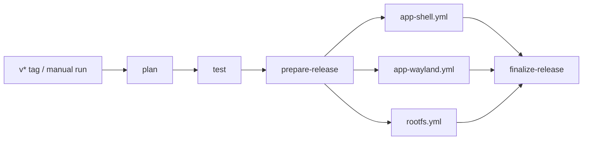

<p align="right">
  <strong>English</strong> | <a href="./README.zh-CN.md">简体中文</a>
</p>

# Anland

Run Linux container applications as Android windows on a rooted ARM64 device. Anland provides a Wayland host, an application launcher, a Root module with audio support, and ARM64 Linux images with integrated desktop fixes. RootFS builds support Debian 13 (default), Ubuntu 26.04, Fedora 43/44 and Arch Linux ARM.

This repository's `dev` branch contains the application and image build pipeline. Builds produce draft Releases; ordinary branch pushes do not run the release workflow.

## Components

| Component | Purpose | Deliverable |
|---|---|---|
| Shell App (`com.anland.shell`) | Container selection and controls, app grid, shortcuts, console, saved local/SSH logins | `anland-shell.apk` |
| Wayland App (`com.anlandnext`) | Window list, activation, scale, rendering and lifecycle settings; hosts Linux windows | `anland-wayland.apk` |
| Client library | Binder connection and window hosting for Android clients | `anland-awllib.aar` |
| Root module (`anland-awl`) | Native `waylandbridge`, SELinux setup, PulseAudio, boot service and appearance bridge | `anland-awl.zip`, standalone `waylandbridge` |
| Linux RootFS | Selectable ARM64 distribution, Docker, Chinese locale, Anland session and optional full Xfce desktop | `anland-rootfs-<distribution>-arm64-<version>.tar.xz` |

The two Apps share responsive Material UI, theme preferences and navigation. Linux windows have Android task identities resolved from desktop metadata and icons. Transient dialogs share their parent task; launch coordination activates existing windows and waits for new windows without restarting the Linux application.

Android touch, keyboard and IME events are forwarded to Wayland. X11 applications use a patched Xwayland. The host supports SurfaceControl and EGL rendering, configurable window scaling, safe-area handling, and controls for automatic attachment and window lifecycle. GPU and touch behavior still require validation on the target device.

## Requirements and installation

- A rooted ARM64 Android device with SukiSU/KernelSU and Droidspaces. Wayland App requires Android 10 or newer; the native daemon is built for Android API 35, so the complete bundle targets Android 15 or newer.
- A configured container environment; GPU compatibility depends on the device and Mesa driver.
- Both Apps and the Root module from a compatible build.

1. Download the selected build's assets from [Releases](https://github.com/zhangyxXyz/anland/releases). Drafts are visible to repository collaborators, not a public distribution channel.
2. Verify downloaded files with `sha256sum -c SHA256SUMS` after downloading all files listed there. Component-specific checksum files are provided for partial downloads.
3. Install the Root module ZIP through the root manager and reboot. Install both APKs.
4. Import/extract the selected Linux RootFS using Droidspaces, then select the container and user in Shell. The image's configured user is `seiun`.
5. Configure the [Droidspaces runtime mount and GPU access](#droidspaces-mounts-and-gpu-access), then start the container and launch applications. The Linux Desktop entry opens the full Xfce desktop; individual applications can keep their own Android windows.

If the image is split, concatenate `.part-000`, `.part-001`, ... in order, then check the reconstructed archive with `ROOTFS-SHA256SUMS`. Test APKs are optional developer tools, not prerequisites for normal use. A build does not deploy files to a device.

## Droidspaces mounts and GPU access

Every container used with Anland needs a **read-write directory bind mount**:

| Android host path | Container path | Contents |
|---|---|---|
| `/data/local/tmp/awl` | `/run/anland` | `wayland-0` display socket, `pulse.sock` audio socket, `anland-wm.sock` window control socket and `appearance/` theme state |

In Droidspaces, stop the container and add this mapping to its bind-mount settings. For a file-based configuration, merge the following settings into `/data/local/Droidspaces/Containers/<container-name>/container.config`, then start the container again:

```ini
bind_mounts=/data/local/tmp/awl:/run/anland
enable_gpu_mode=1
```

If `bind_mounts` already contains mappings, keep them and append `,/data/local/tmp/awl:/run/anland` on the same line. Mount the whole directory, without the `:ro` suffix: the session creates its window-control socket there, and daemon restarts recreate the display/audio sockets. The Root module must be running before the container starts. Its default host runtime directory is `/data/local/tmp/awl`; if `runtime_dir` in `/data/adb/modules/anland-awl/config.json` is customized, use that host path while keeping the container destination `/run/anland`.

GPU mode (`enable_gpu_mode=1`, CLI `--gpu`) exposes the device's GPU nodes. The current Qualcomm KGSL path needs `/dev/kgsl-3d0` and a compatible Mesa driver; the desktop user must have access to that node. On Droidspaces versions that assign it to `droidspaces-gpu`, check the user's group membership and log in again after changing groups. Android storage sharing (`enable_android_storage=1`) is optional for Anland. Termux-X11, VirGL and Droidspaces' separate PulseAudio server are not required by this Anland configuration; display and audio use the Anland Root module.

After starting the module, container and Anland session, check **inside the Linux container**:

```sh
findmnt -T /run/anland
ls -l /run/anland/wayland-0 /run/anland/pulse.sock
ls -l /run/anland/anland-wm.sock /run/anland/appearance/night-mode
# Qualcomm KGSL devices only; run id as the desktop user:
ls -l /dev/kgsl-3d0
id
```

`/run/anland` must be the shared host directory, not an ordinary empty directory. `wayland-0` and `pulse.sock` must be Unix sockets; `anland-wm.sock` appears when the independent-application session is running. Missing display sockets prevent the session from starting, missing audio sockets prevent Android audio output, and missing GPU access prevents the KGSL rendering path from working. Shell expects this mount to be configured; importing a RootFS or selecting a container in Shell does not create it.

## Release pipeline



`build.yml` is the only trigger entry point. The three component workflows use `workflow_call` and run in parallel when selected.

| Trigger | Build selection | Release |
|---|---|---|
| Push `v*` tag | All three components | Draft with the same tag |
| Manual run | Shell / Wayland bundle / RootFS checkboxes | `dev-<SHA>-<run_id>` draft |
| Ordinary branch push or PR | No release build | None |

Manual runs default to both Apps; RootFS is opt-in. When selected, `rootfs_target` chooses one distribution per run and defaults to `Debian-13`. Version tags build all components with the default RootFS target, Debian 13. Selecting no components fails before creating a draft. The Wayland selection includes its APK, test APK, AAR, daemon and Root module. Shell includes its APK and test APK.

Each child uploads directly to one shared draft. Finalization checks the selected jobs, file sizes and GitHub asset SHA256 digests before producing `build-manifest.json` and a unified `SHA256SUMS`. Failed builds remain incomplete drafts. Retries can update the same run's draft; another run cannot overwrite it, and public Releases are never modified by this pipeline. Nothing is automatically published.

For manual runs, the dispatcher must also exist on GitHub's default branch; select `dev` in the branch picker. Updating this branch alone does not alter `main` or the default-branch setting.

## Versions

[`version.properties`](version.properties) is the single configuration entry point. Components have independent versions:

```properties
RELEASE_VERSION=0.5.0
SHELL_VERSION_NAME=0.2.0
SHELL_VERSION_CODE=2
WAYLAND_VERSION_NAME=0.2.0
WAYLAND_VERSION_CODE=2
MODULE_VERSION_NAME=0.5.0
MODULE_VERSION_CODE=5
ROOTFS_VERSION=0.1.0
```

The Git tag must be `v` plus `RELEASE_VERSION`. Component versions do not need to match the tag. Increase an App/module's integer code when issuing a newer version of that component. Unselected components are not rebuilt or relabeled.

Manual CI builds append `-dev.<run_number>+<shortSHA>` to component display versions, including the image version, without changing integer codes. Retrying a run keeps its version. Local builds read the same configuration; optionally set `ANLAND_VERSION_SUFFIX` to reproduce a manual build's suffix.

## Signing and local APK builds

Private files live under the repository's **ignored `keystore/` directory**:

```text
keystore/
  anland-release.jks
  anland-shell.json
  anland-wayland.json
```

Both Apps currently use the repository signing key. The two JSON files can point to separate existing keys if needed; each certificate must match its entry in [`signing-certificates.json`](signing-certificates.json). That tracked file contains public fingerprints only.

Private JSON format (example values only):

```json
{
  "storeFile": "anland-release.jks",
  "storePassword": "<private store password>",
  "keyAlias": "anland",
  "keyPassword": "<private key password>"
}
```

Back up `keystore/` securely. It is not recoverable from a Git clone. A different signing certificate cannot replace an installed APK with the same package name through an ordinary upgrade.

On this Windows development machine:

```powershell
./scripts/build.ps1                    # both Apps, test APKs, AAR and lint
./scripts/build.ps1 -Component shell   # Shell only
./scripts/build.ps1 -Component wayland # Wayland APK, tests and AAR
```

The wrapper accepts `-KeystoreDir`, `-JavaHome`, `-AndroidHome`, `-Python` and `-Bash`. Its defaults use JDK 21, `D:/MyProfile/AndroidSDK` and Git Bash at `D:/MyProfile/Git/bin/bash.exe`. Output is `outputs/apps/`.

For another platform, set `JAVA_HOME`, `ANDROID_HOME` and optionally `ANLAND_KEYSTORE_DIR`, then run:

```sh
python3 scripts/build-apps.py --component all
```

The same script builds CI APKs and verifies the final certificates and embedded versions. Local App builds require SDK 36/build-tools 36.0.0; Wayland also needs NDK 29.0.13113456 and CMake 3.22.1. CI uses JDK 17 and installs these tools explicitly.

GitHub stores the key and private configuration as **Actions Secrets**, restored into the runner's temporary directory:

- `ANLAND_SHELL_KEYSTORE_BASE64` / `ANLAND_SHELL_SIGNING_CONFIG`
- `ANLAND_WAYLAND_KEYSTORE_BASE64` / `ANLAND_WAYLAND_SIGNING_CONFIG`

Synchronize validated local keys without printing private data or triggering Actions:

```sh
python scripts/ci/signing.py sync --repo zhangyxXyz/anland
```

The script validates both certificates before uploading Secrets. Missing/mismatched keys fail the build; CI never generates a replacement key. `scripts/init-signing.py` is an explicit one-time initializer for a new identity and refuses to overwrite existing repository signing files.

## Root module and RootFS builds

Native/module builds require a Linux host, JDK, Android SDK/NDK, CMake, Meson, Ninja, pkg-config, m4 and patch. With signing configured, `make libffi` followed by `make native apk module` builds the Android bundle. `make anlandx` remains an optional source installer for manually managed containers; it is not a default Release asset.

`rootfs.yml` uses an ARM64 runner and Docker. Select a distribution with `rootfs_target` in the manual `build.yml` run:

| Selection | Distribution | Archive identifier |
|---|---|---|
| `Debian-13` (default) | Debian 13 | `debian13` |
| `Ubuntu-26` | Ubuntu 26.04 | `ubuntu2604` |
| `Fedora-43` | Fedora 43 | `fedora43` |
| `Fedora-44` | Fedora 44 | `fedora44` |
| `Arch` | Arch Linux ARM (rolling) | `arch` |

Each target includes Anland Next and the full Xfce desktop launcher. Ubuntu 24.04 and 25.10 are not selectable because the pinned upstream builder does not provide Anland Next for them. Target definitions, the default target, the builder commit, Xfdesktop source and per-distribution session package checksums are in [`rootfs/sources.json`](rootfs/sources.json). The workflow dropdown mirrors this list. All distributions share `ROOTFS_VERSION` in [`version.properties`](version.properties); the target identifier distinguishes their archives. For example: `anland-rootfs-fedora44-arm64-0.1.0.tar.xz`.

A separate Docker build stage derives from the selected runtime image and compiles Xfdesktop with the touch double-tap patch, Xwayland with GPU/input fixes and the current `anland-miniwm`. Xserver uses the repository's pinned submodule. The final stage installs the compiled Xfdesktop files, `/usr/lib/anland/Xwayland`, the session and miniwm, then verifies the distribution, session package version, AArch64 executables, shared-library dependencies and file hashes. Build dependencies remain in the disposable stage. The exported archive is checked against the recorded executable hashes before upload.

Provenance, including the target and compiled Xfdesktop source version, is stored in `/usr/share/anland/rootfs-components.json`; `/usr/share/anland/packages.tsv` lists the native packages. The patched Xfdesktop files overlay the distribution package, so the native package version describes its base package, while the manifest describes the compiled fix. APT holds, DNF exclusions or Pacman `IgnorePkg` protect Xfdesktop and `anland-session` from ordinary upgrades. To deliberately replace them, remove the corresponding protection: `sudo apt-mark unhold xfdesktop4 xfdesktop4-data anland-session` on Debian/Ubuntu, edit `excludepkgs` in `/etc/dnf/dnf.conf` on Fedora, or edit `IgnorePkg` in `/etc/pacman.conf` on Arch. Explicit reinstalls or the upstream TUI's component replacement can overwrite the fixes.

The distribution repositories, base images and other upstream downloads are not fully snapshotted; images are not claimed to be bit-for-bit reproducible. Each selected target must pass its image-build checks; device compatibility also requires runtime validation.

## Development and validation

See [testing and runtime notes](docs/testing.md) for current test commands, launch behavior and device validation boundaries. Local logs and experimental outputs belong in `work/` or `outputs/`, not release documentation.

## License and dependencies

GPL-3.0. Bundled components retain their licenses. The shared UI's MIT license is in [ui-common/LICENSE.MaterialDesignTmpl](ui-common/LICENSE.MaterialDesignTmpl); Debian icon attribution is in [rootfs/assets/README.md](rootfs/assets/README.md). Core dependencies include libwayland, PulseAudio, Xwayland, Xfce, Droidspaces and the [RootFS builder](https://github.com/Goldzxcbug/Droidspaces-rootfs-Desktop-builder).
