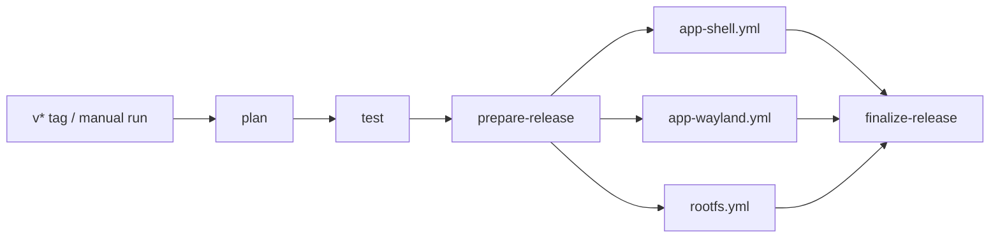

<p align="right">
  <strong>English</strong> | <a href="./README.zh-CN.md">简体中文</a>
</p>

# Anland

Run Linux container applications as Android windows on a rooted ARM64 device. Anland provides a Wayland host, an application launcher, a Root module with audio support, and a Debian 13 image with integrated desktop fixes.

This repository's `dev` branch contains the application and image build pipeline. Builds produce draft Releases; ordinary branch pushes do not run the release workflow.

## Components

| Component | Purpose | Deliverable |
|---|---|---|
| Shell App (`com.anland.shell`) | Container selection and controls, app grid, shortcuts, console, saved local/SSH logins | `anland-shell.apk` |
| Wayland App (`com.anlandnext`) | Window list, activation, scale, rendering and lifecycle settings; hosts Linux windows | `anland-wayland.apk` |
| Client library | Binder connection and window hosting for Android clients | `anland-awllib.aar` |
| Root module (`anland-awl`) | Native `waylandbridge`, SELinux setup, PulseAudio, boot service and appearance bridge | `anland-awl.zip`, standalone `waylandbridge` |
| Debian RootFS | Debian 13 ARM64, Docker, Chinese locale, Anland session and optional full Xfce desktop | `anland-rootfs-debian13-arm64-<version>.tar.xz` |

The two Apps share responsive Material UI, theme preferences and navigation. Linux windows have Android task identities resolved from desktop metadata and icons. Transient dialogs share their parent task; launch coordination activates existing windows and waits for new windows without restarting the Linux application.

Android touch, keyboard and IME events are forwarded to Wayland. X11 applications use a patched Xwayland. The host supports SurfaceControl and EGL rendering, configurable window scaling, safe-area handling, and controls for automatic attachment and window lifecycle. GPU and touch behavior still require validation on the target device.

## Requirements and installation

- A rooted ARM64 Android device with SukiSU/KernelSU and Droidspaces. Wayland App requires Android 10 or newer; the native daemon is built for Android API 35, so the complete bundle targets Android 15 or newer.
- A configured container environment; GPU compatibility depends on the device and Mesa driver.
- Both Apps and the Root module from a compatible build.

1. Download the selected build's assets from [Releases](https://github.com/zhangyxXyz/anland/releases). Drafts are visible to repository collaborators, not a public distribution channel.
2. Verify downloaded files with `sha256sum -c SHA256SUMS` after downloading all files listed there. Component-specific checksum files are provided for partial downloads.
3. Install the Root module ZIP through the root manager and reboot. Install both APKs.
4. Import/extract the Debian RootFS using Droidspaces, then select the container and user in Shell. The image's configured user is `seiun`.
5. Start the container and launch applications. The Linux Desktop entry opens the full Xfce desktop; individual applications can keep their own Android windows.

If the image is split, concatenate `.part-000`, `.part-001`, ... in order, then check the reconstructed archive with `ROOTFS-SHA256SUMS`. Test APKs are optional developer tools, not prerequisites for normal use. A build does not deploy files to a device.

## Release pipeline



`build.yml` is the only trigger entry point. The three component workflows use `workflow_call` and run in parallel when selected.

| Trigger | Build selection | Release |
|---|---|---|
| Push `v*` tag | All three components | Draft with the same tag |
| Manual run | Shell / Wayland bundle / RootFS checkboxes | `dev-<SHA>-<run_id>` draft |
| Ordinary branch push or PR | No release build | None |

Manual runs default to both Apps; RootFS is opt-in. Selecting no components fails before creating a draft. The Wayland selection includes its APK, test APK, AAR, daemon and Root module. Shell includes its APK and test APK.

Each child uploads directly to one shared draft. Finalization checks the selected jobs, file sizes and GitHub asset SHA256 digests before producing `build-manifest.json` and a unified `SHA256SUMS`. Failed builds remain incomplete drafts. Retries can update the same run's draft; another run cannot overwrite it, and public Releases are never modified by this pipeline. Nothing is automatically published.

For manual runs, the dispatcher must also exist on GitHub's default branch; select `dev` in the branch picker. Updating this branch alone does not alter `main` or the default-branch setting.

## Versions

[`version.properties`](version.properties) is the single configuration entry point. Components have independent versions:

```properties
RELEASE_VERSION=0.5.0
SHELL_VERSION_NAME=0.2.0
SHELL_VERSION_CODE=2
WAYLAND_VERSION_NAME=0.2.0
WAYLAND_VERSION_CODE=2
MODULE_VERSION_NAME=0.5.0
MODULE_VERSION_CODE=5
ROOTFS_VERSION=0.1.0
```

The Git tag must be `v` plus `RELEASE_VERSION`. Component versions do not need to match the tag. Increase an App/module's integer code when issuing a newer version of that component. Unselected components are not rebuilt or relabeled.

Manual CI builds append `-dev.<run_number>+<shortSHA>` to component display versions, including the image version, without changing integer codes. Retrying a run keeps its version. Local builds read the same configuration; optionally set `ANLAND_VERSION_SUFFIX` to reproduce a manual build's suffix.

## Signing and local APK builds

Private files live under the repository's **ignored `keystore/` directory**:

```text
keystore/
  anland-release.jks
  anland-shell.json
  anland-wayland.json
```

Both Apps currently use the repository signing key. The two JSON files can point to separate existing keys if needed; each certificate must match its entry in [`signing-certificates.json`](signing-certificates.json). That tracked file contains public fingerprints only.

Private JSON format (example values only):

```json
{
  "storeFile": "anland-release.jks",
  "storePassword": "<private store password>",
  "keyAlias": "anland",
  "keyPassword": "<private key password>"
}
```

Back up `keystore/` securely. It is not recoverable from a Git clone. A different signing certificate cannot replace an installed APK with the same package name through an ordinary upgrade.

On this Windows development machine:

```powershell
./scripts/build.ps1                    # both Apps, test APKs, AAR and lint
./scripts/build.ps1 -Component shell   # Shell only
./scripts/build.ps1 -Component wayland # Wayland APK, tests and AAR
```

The wrapper accepts `-KeystoreDir`, `-JavaHome`, `-AndroidHome`, `-Python` and `-Bash`. Its defaults use JDK 21, `D:/MyProfile/AndroidSDK` and Git Bash at `D:/MyProfile/Git/bin/bash.exe`. Output is `outputs/apps/`.

For another platform, set `JAVA_HOME`, `ANDROID_HOME` and optionally `ANLAND_KEYSTORE_DIR`, then run:

```sh
python3 scripts/build-apps.py --component all
```

The same script builds CI APKs and verifies the final certificates and embedded versions. Local App builds require SDK 36/build-tools 36.0.0; Wayland also needs NDK 29.0.13113456 and CMake 3.22.1. CI uses JDK 17 and installs these tools explicitly.

GitHub stores the key and private configuration as **Actions Secrets**, restored into the runner's temporary directory:

- `ANLAND_SHELL_KEYSTORE_BASE64` / `ANLAND_SHELL_SIGNING_CONFIG`
- `ANLAND_WAYLAND_KEYSTORE_BASE64` / `ANLAND_WAYLAND_SIGNING_CONFIG`

Synchronize validated local keys without printing private data or triggering Actions:

```sh
python scripts/ci/signing.py sync --repo zhangyxXyz/anland
```

The script validates both certificates before uploading Secrets. Missing/mismatched keys fail the build; CI never generates a replacement key. `scripts/init-signing.py` is an explicit one-time initializer for a new identity and refuses to overwrite existing repository signing files.

## Root module and RootFS builds

Native/module builds require a Linux host, JDK, Android SDK/NDK, CMake, Meson, Ninja, pkg-config, m4 and patch. With signing configured, `make libffi` followed by `make native apk module` builds the Android bundle. `make anlandx` remains an optional source installer for manually managed containers; it is not a default Release asset.

`rootfs.yml` uses an ARM64 runner and Docker. It builds Xfdesktop with the touch double-tap patch, Xwayland with GPU/input fixes, and the current `anland-miniwm`. The builder and session base package are locked in [`rootfs/sources.json`](rootfs/sources.json); the xserver source is the repository's pinned submodule. A changed session package checksum stops the build.

The final Docker stage installs the patched `.deb` files, places Xwayland at `/usr/lib/anland/Xwayland`, installs the current session and miniwm, and verifies versions, shared-library dependencies and runtime paths. The exported archive is checked again against the recorded binary hashes. The image is ready to use without a separate component replacement step.

Provenance is stored in `/usr/share/anland/rootfs-components.json` and the installed package list in `/usr/share/anland/dpkg-packages.tsv`. The image holds `xfdesktop4`, `xfdesktop4-data` and `anland-session` to preserve the integrated fixes during ordinary APT upgrades. Deliberate replacement requires `sudo apt-mark unhold xfdesktop4 xfdesktop4-data anland-session`. Debian repositories, the base image and other upstream downloads are not fully snapshotted; the image is not claimed to be bit-for-bit reproducible.

## Development and validation

See [testing and runtime notes](docs/testing.md) for current test commands, launch behavior and device validation boundaries. Local logs and experimental outputs belong in `work/` or `outputs/`, not release documentation.

## License and dependencies

GPL-3.0. Bundled components retain their licenses. The shared UI's MIT license is in [ui-common/LICENSE.MaterialDesignTmpl](ui-common/LICENSE.MaterialDesignTmpl); Debian icon attribution is in [rootfs/assets/README.md](rootfs/assets/README.md). Core dependencies include libwayland, PulseAudio, Xwayland, Xfce, Droidspaces and the [RootFS builder](https://github.com/Goldzxcbug/Droidspaces-rootfs-Desktop-builder).
