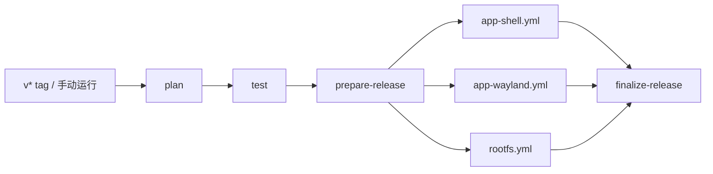

<p align="right">
  <a href="./README.md">English</a> | <strong>简体中文</strong>
</p>

# Anland

上游项目：[SuperTurtleDev/anland](https://github.com/SuperTurtleDev/anland)。[zhangyxXyz](https://github.com/zhangyxXyz) 是本分支维护者；本分支的源码、问题反馈和 App 更新由 [zhangyxXyz/anland](https://github.com/zhangyxXyz/anland) 提供。

在已 root 的 ARM64 Android 设备上，以 Android 窗口运行 Linux 容器应用。Anland 包含 Wayland 宿主、应用启动器、带音频支持的 Root 模块，以及集成桌面修复的 ARM64 Linux 镜像。RootFS 构建支持 Debian 13（默认）、Ubuntu 26.04、Fedora 43/44 和 Arch Linux ARM。

本仓库 `dev` 分支维护应用与镜像构建流水线。构建产物进入草稿 Release；普通分支推送不会运行发布流水线。

## 组件

| 组件 | 用途 | 产物 |
|---|---|---|
| Shell App（`com.anland.shell`） | 容器选择与控制、应用列表、快捷方式、控制台、保存的本地/SSH 登录 | `anland-shell.apk` |
| Wayland App（`com.anlandnext`） | 窗口列表、激活、缩放、渲染及生命周期设置，承载 Linux 窗口 | `anland-wayland.apk` |
| 客户端库 | 为 Android 客户端提供 Binder 连接和窗口托管 | `anland-awllib.aar` |
| Root 模块（`anland-awl`） | 原生 `waylandbridge`、SELinux 配置、PulseAudio、开机服务及外观同步 | `anland-awl.zip`、独立的 `waylandbridge` |
| Linux RootFS | 可选 ARM64 发行版、Docker、中文环境、Anland 会话及可选的完整 Xfce 桌面 | `anland-rootfs-<发行版>-arm64-<版本>.tar.xz` |

两款 App 共用响应式 Material 界面、主题偏好和导航。Linux 窗口根据桌面元数据与图标确定 Android 任务身份；返回会将独立窗口置于后台，保留最近任务卡片以便恢复；临时对话框共享父任务。启动协调负责激活已有窗口或等待新窗口，不需要重启 Linux 应用。

Wayland 导航包含**窗口、配置、设置**三个平级页面。配置按**任务与启动、显示、输入**分组；“任务卡片显示容器名称”默认关闭。开启后，最近任务卡片和窗口列表的名称追加 Droidspaces 登记的实际容器名称，例如 `Google Chrome · HostDebian`。调整开关会即时刷新已有的存活任务和列表，不重启 Linux 应用；Android 进程已被回收的卡片在恢复时更新。无法识别来源时保留原名称。容器识别需要配套版本的 Root 模块。

Android 的触摸、键盘和 IME 事件被转发到 Wayland；X11 应用通过修复版 Xwayland 运行。宿主支持 SurfaceControl 与 EGL 渲染、窗口缩放、安全区域适配，以及自动挂载和窗口生命周期设置。GPU 与触控表现仍需在目标设备上验证。

Shell 提供独立的「凭据」页面，可将本地或 SSH 登录凭据绑定到容器用户。启动应用、桌面、快捷方式和本地控制台时会校验绑定；SSH 绑定要求已信任的主机密钥，并通过临时证明确认连接到选定容器及用户。容器环境变量在「容器」页面配置。

## 环境与安装

- 已 root、具备 SukiSU/KernelSU 和 Droidspaces 的 ARM64 Android 设备。Wayland App 最低要求 Android 10；原生服务按 Android API 35 构建，因此整套产物面向 Android 15 及以上。
- 已配置容器环境；GPU 兼容性取决于设备和 Mesa 驱动。
- 来自兼容构建的两款 App 和 Root 模块。

1. 从 [Releases](https://github.com/zhangyxXyz/anland/releases) 下载所需产物。草稿仅对仓库协作者可见，不是公开分发渠道。
2. 下载校验清单中的所有文件后，执行 `sha256sum -c SHA256SUMS`。只下载部分组件时可使用各组件自己的校验文件。
3. 在 root 管理器中安装模块 ZIP 并重启，安装两款 APK。
4. 使用 Droidspaces 导入/解压所选 Linux RootFS，在 Shell 中选择容器和用户。镜像预设用户为 `seiun`。
5. 配置下方的 [Droidspaces 挂载与 GPU](#droidspaces-挂载与-gpu-配置)，再启动容器并打开应用。「Linux 桌面」入口启动完整 Xfce 桌面；独立应用可继续使用各自的 Android 窗口。

如果镜像分卷，按 `.part-000`、`.part-001`……顺序合并，再用 `ROOTFS-ARCHIVE-SHA256SUMS` 校验还原后的文件。测试 APK 仅供开发验证，正常使用无需安装。构建不会自动部署到设备。

## Droidspaces 挂载与 GPU 配置

每个用于 Anland 的容器都需要配置一条**目录读写绑定挂载**：

| Android 宿主路径 | 容器内路径 | 用途 |
|---|---|---|
| `/data/local/tmp/awl` | `/run/anland` | `wayland-0` 显示 socket、`pulse.sock` 音频 socket、`anland-wm.sock` 窗口控制 socket，以及 `appearance/` 外观状态 |

在 Droidspaces 中停止容器，将这条映射添加到容器的绑定挂载设置。使用配置文件时，将以下字段合并到 `/data/local/Droidspaces/Containers/<容器名>/container.config`，保存后重新启动容器：

```ini
bind_mounts=/data/local/tmp/awl:/run/anland
enable_gpu_mode=1
```

如果已有 `bind_mounts`，保留原有映射，在同一行追加 `,/data/local/tmp/awl:/run/anland`。需要挂载整个目录，不添加 `:ro`：会话会在这里创建窗口控制 socket，宿主服务重启也会重新创建显示和音频 socket。启动容器前应先确保 Root 模块服务已运行。模块默认宿主运行目录为 `/data/local/tmp/awl`；若在 `/data/adb/modules/anland-awl/config.json` 中自定义了 `runtime_dir`，挂载源应使用该路径，容器目标仍保持 `/run/anland`。

GPU 模式（`enable_gpu_mode=1`，命令行对应 `--gpu`）负责向容器提供设备的 GPU 节点。当前 Qualcomm KGSL 路径需要 `/dev/kgsl-3d0` 和兼容的 Mesa 驱动，桌面用户也必须有权访问该节点。Droidspaces 将节点分配给 `droidspaces-gpu` 组时，需要检查用户的组成员身份；修改组后重新登录。Android 存储共享（`enable_android_storage=1`）属于可选功能。本套 Anland 配置的显示和音频由 Root 模块提供，无需额外启用 Termux-X11、VirGL 或 Droidspaces 自带的 PulseAudio 服务。

启动模块、容器和 Anland 会话后，**在 Linux 容器内**检查：

```sh
findmnt -T /run/anland
ls -l /run/anland/wayland-0 /run/anland/pulse.sock
ls -l /run/anland/anland-wm.sock /run/anland/appearance/night-mode
# 以下 GPU 节点仅针对 Qualcomm KGSL 设备；id 应以桌面用户执行：
ls -l /dev/kgsl-3d0
id
```

`/run/anland` 必须指向宿主共享目录，不能只是普通空目录。`wayland-0`、`pulse.sock` 应为 Unix socket；独立应用会话运行后会出现 `anland-wm.sock`。缺少显示 socket 会导致会话无法启动，缺少音频 socket 会导致声音无法输出到 Android，缺少 GPU 访问权限会导致 KGSL 渲染不可用。Shell 依赖这条预先配置的挂载；导入 RootFS 或在 Shell 中选择容器不会自动创建它。

## App 备份与更新

两款 App 均提供 **设置 → 备份与恢复** 和 **设置 → 关于 → 检查更新 / 版本历史**，界面沿用 MaterialDesignTmpl 的布局。备份支持选择本地目录、WebDAV 连接测试、上传/列表/恢复、本地与远端独立保留数量，以及 AES 加密压缩包。文件按 App 区分，Shell 与 Wayland 的备份不会互相覆盖或清理。

Shell 备份包含 App 配置及已保存的本地/SSH 登录凭据。导出登录秘密或 WebDAV 密码需要先设置备份加密密码；恢复的登录凭据会使用目标设备的 Android Keystore 重新加密。Wayland 备份包含本机 App 配置。容器文件、Root 模块、守护进程配置和命令历史不在备份范围内。WebDAV 密码与备份加密密码在本机加密保存；跨设备恢复时，需要另外保存好备份密码。

更新源为 `zhangyxXyz/anland` 的公开 GitHub Releases API。每款 App 从构建完整、已公开的稳定 `v*` Release 读取 `build-manifest.json`，比较自己的 `SHELL_VERSION_CODE` 或 `WAYLAND_VERSION_CODE`，与整套发布的 `RELEASE_VERSION` 独立。Shell 只匹配 `anland-shell.apk`，Wayland 只匹配 `anland-wayland.apk`；只包含其他组件的 Release 会被跳过。草稿、开发 Tag 和预发布版本不作为 App 更新提供。

下载完成后校验清单中的 SHA256、包名、组件版本及当前安装签名，再打开 Android 系统安装器。需要安装权限时，授权返回后继续安装。发布更新时，在 `version.properties` 中提高对应 App 的版本名和版本代码，构建匹配的版本 Tag，检查完成的草稿后再公开发布。保留发布清单及原始 APK 文件名；仅创建草稿不会向用户提供更新。

## 发布流水线

默认分支为 `dev`。Actions 清理工作流每周日北京时间 08:00 执行，保留每个工作流最近 6 次运行及近 30 天内的全部记录，只删除已完成的更早记录；手动运行默认仅预览。



`build.yml` 是唯一触发入口。三个组件 workflow 使用 `workflow_call`，被选择后并行运行。

| 触发方式 | 构建范围 | Release |
|---|---|---|
| 推送 `v*` tag | 三个组件全部构建 | 使用该 tag 的草稿 |
| 手动运行 | 勾选 Shell / Wayland 整套组件 / RootFS | `dev-<SHA>-<run_id>` 草稿 |
| 普通分支推送或 PR | 不执行发布构建 | 无 |

手动运行默认选择两款 App，RootFS 按需选择。勾选后通过 `rootfs_target` 选择本次构建的一个发行版，默认 `Debian-13`。版本 Tag 构建全部组件，RootFS 使用默认的 Debian 13。全部不选会在创建草稿前失败。Wayland 选项包含 APK、测试 APK、AAR、原生服务和 Root 模块；Shell 包含 APK 和测试 APK。

子流程直接上传到同一个草稿。汇总阶段核对所选任务、文件大小及 GitHub 附件 SHA256，再生成 `build-manifest.json` 和统一的 `SHA256SUMS`。失败构建保留为未完成草稿。同一运行可重试更新自己的草稿，其他运行不能覆盖它；流水线不会修改已公开的 Release，也不会自动公开发布。

手动入口还需要默认分支上存在 dispatcher，运行时在分支选择器中选择 `dev`。仅更新本分支不会修改 `main` 或默认分支设置。

## 版本管理

[`version.properties`](version.properties) 是唯一版本配置入口，各组件独立编号：

```properties
RELEASE_VERSION=0.5.3
SHELL_VERSION_NAME=0.2.3
SHELL_VERSION_CODE=5
WAYLAND_VERSION_NAME=0.2.3
WAYLAND_VERSION_CODE=5
MODULE_VERSION_NAME=0.5.1
MODULE_VERSION_CODE=6
ROOTFS_VERSION=0.1.1
```

Git tag 必须等于 `v` 加 `RELEASE_VERSION`，不要求各组件版本与 tag 相同。发布某个 App/模块的新版本时，递增该组件的整数版本号。未选择的组件不会重建，也不会重新标注版本。

手动 CI 构建会在组件显示版本（包括镜像版本）后追加 `-dev.<run_number>+<短SHA>`，整数版本号不变；同一次运行重试保持版本不变。本地构建读取同一配置，可设置 `ANLAND_VERSION_SUFFIX` 复现手动构建的版本后缀。

## 签名与本地 APK 打包

私有文件保存在仓库根目录下、**被 Git 忽略的 `keystore/` 目录**：

```text
keystore/
  anland-release.jks
  anland-shell.json
  anland-wayland.json
```

两款 App 当前使用仓库签名密钥。需要复用不同密钥时，两份 JSON 可分别指向对应文件；证书必须与 [`signing-certificates.json`](signing-certificates.json) 中相应条目一致。这个已跟踪文件只保存公开指纹。

私有 JSON 格式如下，以下均为示例值：

```json
{
  "storeFile": "anland-release.jks",
  "storePassword": "<私有存储密码>",
  "keyAlias": "anland",
  "keyPassword": "<私有密钥密码>"
}
```

请安全备份 `keystore/`，Git 克隆无法恢复它。不同签名证书不能通过普通覆盖安装替换同包名的已安装 APK。

在当前 Windows 开发机执行：

```powershell
./scripts/build.ps1                    # 两款 App、测试 APK、AAR 和 lint
./scripts/build.ps1 -Component shell   # 仅 Shell
./scripts/build.ps1 -Component wayland # Wayland APK、测试 APK 和 AAR
```

脚本支持 `-KeystoreDir`、`-JavaHome`、`-AndroidHome`、`-Python`、`-Bash` 参数。默认使用 JDK 21、`D:/MyProfile/AndroidSDK` 和 `D:/MyProfile/Git/bin/bash.exe`。产物位于 `outputs/apps/`。

其他平台先设置 `JAVA_HOME`、`ANDROID_HOME`，按需设置 `ANLAND_KEYSTORE_DIR`，然后运行：

```sh
python3 scripts/build-apps.py --component all
```

CI 使用同一脚本构建 APK，并检查最终证书与嵌入版本。本地 App 构建需要 SDK 36/build-tools 36.0.0；Wayland 还需要 NDK 29.0.13113456 和 CMake 3.22.1。CI 使用 JDK 17，显式安装这些工具。

GitHub 通过 **Actions Secrets** 保存密钥与私有配置，在 runner 临时目录恢复：

- `ANLAND_SHELL_KEYSTORE_BASE64` / `ANLAND_SHELL_SIGNING_CONFIG`
- `ANLAND_WAYLAND_KEYSTORE_BASE64` / `ANLAND_WAYLAND_SIGNING_CONFIG`

同步本地密钥，不输出私有数据，也不会触发 Actions：

```sh
python scripts/ci/signing.py sync --repo zhangyxXyz/anland
```

脚本先验证两款 App 的证书，再上传 Secrets。密钥缺失或不匹配会停止构建，CI 不会自动生成替代密钥。`scripts/init-signing.py` 仅用于显式初始化新的签名身份，遇到已有仓库签名文件会拒绝覆盖。

## Root 模块与 RootFS 构建

原生服务/模块构建需要 Linux 主机、JDK、Android SDK/NDK、CMake、Meson、Ninja、pkg-config、m4 和 patch。配置签名后，先执行 `make libffi`，再执行 `make native apk module` 构建 Android 侧产物。`make anlandx` 仍可生成手工管理容器用的源码安装包，但它不是默认 Release 附件。

`rootfs.yml` 使用 ARM64 runner 和 Docker。在手动运行 `build.yml` 时，通过 `rootfs_target` 选择发行版：

| 选项 | 发行版 | 产物标识 |
|---|---|---|
| `Debian-13`（默认） | Debian 13 | `debian13` |
| `Ubuntu-26` | Ubuntu 26.04 | `ubuntu2604` |
| `Fedora-43` | Fedora 43 | `fedora43` |
| `Fedora-44` | Fedora 44 | `fedora44` |
| `Arch` | Arch Linux ARM（滚动更新） | `arch` |

各目标均包含 Anland Next 和完整 Xfce 桌面入口。固定版本的上游 builder 没有为 Ubuntu 24.04、25.10 提供 Anland Next，因此这两个版本不在可选范围。目标定义、默认发行版、builder commit、Xfdesktop 源码及各发行版会话包的校验值统一存放在 [`rootfs/sources.json`](rootfs/sources.json)，workflow 下拉列表与其保持一致。所有发行版共用 [`version.properties`](version.properties) 中的 `ROOTFS_VERSION`，通过文件名中的发行版标识区分，例如 `anland-rootfs-fedora44-arm64-0.1.1.tar.xz`。

独立的 Docker 编译阶段以所选运行镜像为基础，编译包含触控双击补丁的 Xfdesktop、包含 GPU/输入修复的 Xwayland，以及当前源码的 `anland-miniwm`。Xserver 使用仓库固定的 submodule。最终阶段安装编译后的 Xfdesktop 文件、`/usr/lib/anland/Xwayland`、会话脚本和 miniwm，校验发行版、会话包版本、AArch64 可执行文件、动态库依赖和文件哈希。编译依赖保留在临时阶段，导出镜像上传前再次检查可执行文件哈希。

`/usr/share/anland/rootfs-components.json` 记录目标发行版、编译的 Xfdesktop 源码版本等来源信息；`/usr/share/anland/packages.tsv` 列出原生软件包。修复后的 Xfdesktop 文件覆盖发行版包中的对应文件，因此包管理器中的版本表示基础包版本，清单表示实际编译的修复来源。镜像通过 APT hold、DNF 排除项或 Pacman `IgnorePkg` 保护 Xfdesktop 和 `anland-session`，避免普通升级覆盖修复。需要主动替换时，Debian/Ubuntu 执行 `sudo apt-mark unhold xfdesktop4 xfdesktop4-data anland-session`；Fedora 修改 `/etc/dnf/dnf.conf` 的 `excludepkgs`；Arch 修改 `/etc/pacman.conf` 的 `IgnorePkg`。显式重装或上游 TUI 的组件替换仍可能覆盖修复文件。

发行版软件源、基础镜像及其他上游下载没有完整快照固定，因此不承诺镜像逐字节可复现。每个所选目标都需要通过镜像构建检查，设备兼容性还需运行验证。

## 开发与验证

当前测试命令、启动行为与真机验证范围见 [测试与运行说明](docs/testing.md)。本地日志和实验产物放在 `work/` 或 `outputs/`，不写入发布文档。

## 许可证与依赖

GPL-3.0，随附组件保留各自许可证。共享 UI 的 MIT 许可证位于 [ui-common/LICENSE.MaterialDesignTmpl](ui-common/LICENSE.MaterialDesignTmpl)，Debian 图标署名见 [rootfs/assets/README.md](rootfs/assets/README.md)。主要依赖包括 libwayland、PulseAudio、Xwayland、Xfce、Droidspaces 和 [RootFS builder](https://github.com/Goldzxcbug/Droidspaces-rootfs-Desktop-builder)。

## 外观同步与应用内项目信息

打开或聚焦 Linux 窗口保持当前主题控制来源，实际深浅色未变时不重复设置外观。App 回到前台时会刷新 Android 主题状态，并恢复已停止的同步进程；Shell APK 内置同步脚本，恢复无需重新刷入 Root 模块。

Linux 会话跟随最近切到前台的 Anland Shell 或 Wayland App 的实际主题。选择**跟随系统**时，App 退到后台后仍持续跟随 Android 的自动深浅色变化；选择**浅色**或**深色**时，保持该选择。完整桌面与独立 Linux 应用共用这一会话偏好。Linux 应用自身明确指定的主题保持不变；动态切换取决于应用对 GTK/XSettings 或 Settings portal 的支持。支持此功能的网页通过浏览器接收 `prefers-color-scheme` 变化。

Shell 为两款 App 提供签名权限保护的外观同步入口，Wayland 无需额外申请 Root 权限。运行目录挂载中的 `appearance/app-theme` 保存当前控制 App 与主题策略，`appearance/night-mode` 保存 Android 系统状态。容器需要更新后的 Anland 会话／外观脚本，以及 `xfce4-settings`、`gsettings-desktop-schemas`、`xdg-desktop-portal`、`xdg-desktop-portal-gtk`；仅安装 APK 不会自动补齐这些 Linux 组件。发布的 RootFS 镜像已包含它们。

两款 App 从 `zhangyxXyz/anland` 的公开 Releases 检查更新，按各自组件版本匹配 APK。更新功能校验统一构建清单或组件清单，以及 APK 大小、哈希、包名、版本和签名。没有可安装组件的 Release 仍显示在更新历史中。公开更新检查无需 GitHub App ID 或登录。

**项目说明**在线读取 App 当前所选语言的仓库 README，缺失时回退至可用中文或默认英文文档；**开源许可**直接读取仓库许可原文。两者均在应用内文档面板展示，网络失败后可再次点击入口重试。各组件和依赖自身的许可仍然适用。
