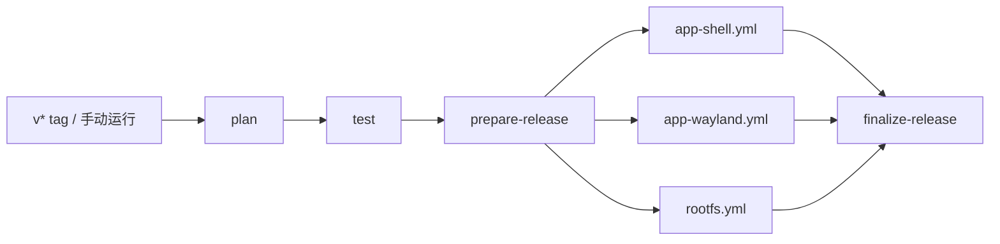

<p align="right">
  <a href="./README.md">English</a> | <strong>简体中文</strong>
</p>

# Anland

在已 root 的 ARM64 Android 设备上，以 Android 窗口运行 Linux 容器应用。Anland 包含 Wayland 宿主、应用启动器、带音频支持的 Root 模块，以及集成桌面修复的 Debian 13 镜像。

本仓库 `dev` 分支维护应用与镜像构建流水线。构建产物进入草稿 Release；普通分支推送不会运行发布流水线。

## 组件

| 组件 | 用途 | 产物 |
|---|---|---|
| Shell App（`com.anland.shell`） | 容器选择与控制、应用列表、快捷方式、控制台、保存的本地/SSH 登录 | `anland-shell.apk` |
| Wayland App（`com.anlandnext`） | 窗口列表、激活、缩放、渲染及生命周期设置，承载 Linux 窗口 | `anland-wayland.apk` |
| 客户端库 | 为 Android 客户端提供 Binder 连接和窗口托管 | `anland-awllib.aar` |
| Root 模块（`anland-awl`） | 原生 `waylandbridge`、SELinux 配置、PulseAudio、开机服务及外观同步 | `anland-awl.zip`、独立的 `waylandbridge` |
| Debian RootFS | Debian 13 ARM64、Docker、中文环境、Anland 会话及可选的完整 Xfce 桌面 | `anland-rootfs-debian13-arm64-<版本>.tar.xz` |

两款 App 共用响应式 Material 界面、主题偏好和导航。Linux 窗口根据桌面元数据与图标确定 Android 任务身份；临时对话框共享父任务。启动协调负责激活已有窗口或等待新窗口，不需要重启 Linux 应用。

Android 的触摸、键盘和 IME 事件被转发到 Wayland；X11 应用通过修复版 Xwayland 运行。宿主支持 SurfaceControl 与 EGL 渲染、窗口缩放、安全区域适配，以及自动挂载和窗口生命周期设置。GPU 与触控表现仍需在目标设备上验证。

## 环境与安装

- 已 root、具备 SukiSU/KernelSU 和 Droidspaces 的 ARM64 Android 设备。Wayland App 最低要求 Android 10；原生服务按 Android API 35 构建，因此整套产物面向 Android 15 及以上。
- 已配置容器环境；GPU 兼容性取决于设备和 Mesa 驱动。
- 来自兼容构建的两款 App 和 Root 模块。

1. 从 [Releases](https://github.com/zhangyxXyz/anland/releases) 下载所需产物。草稿仅对仓库协作者可见，不是公开分发渠道。
2. 下载校验清单中的所有文件后，执行 `sha256sum -c SHA256SUMS`。只下载部分组件时可使用各组件自己的校验文件。
3. 在 root 管理器中安装模块 ZIP 并重启，安装两款 APK。
4. 使用 Droidspaces 导入/解压 Debian RootFS，在 Shell 中选择容器和用户。镜像预设用户为 `seiun`。
5. 启动容器并打开应用。「Linux 桌面」入口启动完整 Xfce 桌面；独立应用可继续使用各自的 Android 窗口。

如果镜像分卷，按 `.part-000`、`.part-001`……顺序合并，再用 `ROOTFS-SHA256SUMS` 校验还原后的文件。测试 APK 仅供开发验证，正常使用无需安装。构建不会自动部署到设备。

## 发布流水线



`build.yml` 是唯一触发入口。三个组件 workflow 使用 `workflow_call`，被选择后并行运行。

| 触发方式 | 构建范围 | Release |
|---|---|---|
| 推送 `v*` tag | 三个组件全部构建 | 使用该 tag 的草稿 |
| 手动运行 | 勾选 Shell / Wayland 整套组件 / RootFS | `dev-<SHA>-<run_id>` 草稿 |
| 普通分支推送或 PR | 不执行发布构建 | 无 |

手动运行默认选择两款 App，RootFS 按需选择。全部不选会在创建草稿前失败。Wayland 选项包含 APK、测试 APK、AAR、原生服务和 Root 模块；Shell 包含 APK 和测试 APK。

子流程直接上传到同一个草稿。汇总阶段核对所选任务、文件大小及 GitHub 附件 SHA256，再生成 `build-manifest.json` 和统一的 `SHA256SUMS`。失败构建保留为未完成草稿。同一运行可重试更新自己的草稿，其他运行不能覆盖它；流水线不会修改已公开的 Release，也不会自动公开发布。

手动入口还需要默认分支上存在 dispatcher，运行时在分支选择器中选择 `dev`。仅更新本分支不会修改 `main` 或默认分支设置。

## 版本管理

[`version.properties`](version.properties) 是唯一版本配置入口，各组件独立编号：

```properties
RELEASE_VERSION=0.5.0
SHELL_VERSION_NAME=0.2.0
SHELL_VERSION_CODE=2
WAYLAND_VERSION_NAME=0.2.0
WAYLAND_VERSION_CODE=2
MODULE_VERSION_NAME=0.5.0
MODULE_VERSION_CODE=5
ROOTFS_VERSION=0.1.0
```

Git tag 必须等于 `v` 加 `RELEASE_VERSION`，不要求各组件版本与 tag 相同。发布某个 App/模块的新版本时，递增该组件的整数版本号。未选择的组件不会重建，也不会重新标注版本。

手动 CI 构建会在组件显示版本（包括镜像版本）后追加 `-dev.<run_number>+<短SHA>`，整数版本号不变；同一次运行重试保持版本不变。本地构建读取同一配置，可设置 `ANLAND_VERSION_SUFFIX` 复现手动构建的版本后缀。

## 签名与本地 APK 打包

私有文件保存在仓库根目录下、**被 Git 忽略的 `keystore/` 目录**：

```text
keystore/
  anland-release.jks
  anland-shell.json
  anland-wayland.json
```

两款 App 当前使用仓库签名密钥。需要复用不同密钥时，两份 JSON 可分别指向对应文件；证书必须与 [`signing-certificates.json`](signing-certificates.json) 中相应条目一致。这个已跟踪文件只保存公开指纹。

私有 JSON 格式如下，以下均为示例值：

```json
{
  "storeFile": "anland-release.jks",
  "storePassword": "<私有存储密码>",
  "keyAlias": "anland",
  "keyPassword": "<私有密钥密码>"
}
```

请安全备份 `keystore/`，Git 克隆无法恢复它。不同签名证书不能通过普通覆盖安装替换同包名的已安装 APK。

在当前 Windows 开发机执行：

```powershell
./scripts/build.ps1                    # 两款 App、测试 APK、AAR 和 lint
./scripts/build.ps1 -Component shell   # 仅 Shell
./scripts/build.ps1 -Component wayland # Wayland APK、测试 APK 和 AAR
```

脚本支持 `-KeystoreDir`、`-JavaHome`、`-AndroidHome`、`-Python`、`-Bash` 参数。默认使用 JDK 21、`D:/MyProfile/AndroidSDK` 和 `D:/MyProfile/Git/bin/bash.exe`。产物位于 `outputs/apps/`。

其他平台先设置 `JAVA_HOME`、`ANDROID_HOME`，按需设置 `ANLAND_KEYSTORE_DIR`，然后运行：

```sh
python3 scripts/build-apps.py --component all
```

CI 使用同一脚本构建 APK，并检查最终证书与嵌入版本。本地 App 构建需要 SDK 36/build-tools 36.0.0；Wayland 还需要 NDK 29.0.13113456 和 CMake 3.22.1。CI 使用 JDK 17，显式安装这些工具。

GitHub 通过 **Actions Secrets** 保存密钥与私有配置，在 runner 临时目录恢复：

- `ANLAND_SHELL_KEYSTORE_BASE64` / `ANLAND_SHELL_SIGNING_CONFIG`
- `ANLAND_WAYLAND_KEYSTORE_BASE64` / `ANLAND_WAYLAND_SIGNING_CONFIG`

同步本地密钥，不输出私有数据，也不会触发 Actions：

```sh
python scripts/ci/signing.py sync --repo zhangyxXyz/anland
```

脚本先验证两款 App 的证书，再上传 Secrets。密钥缺失或不匹配会停止构建，CI 不会自动生成替代密钥。`scripts/init-signing.py` 仅用于显式初始化新的签名身份，遇到已有仓库签名文件会拒绝覆盖。

## Root 模块与 RootFS 构建

原生服务/模块构建需要 Linux 主机、JDK、Android SDK/NDK、CMake、Meson、Ninja、pkg-config、m4 和 patch。配置签名后，先执行 `make libffi`，再执行 `make native apk module` 构建 Android 侧产物。`make anlandx` 仍可生成手工管理容器用的源码安装包，但它不是默认 Release 附件。

`rootfs.yml` 使用 ARM64 runner 和 Docker，编译包含触控双击补丁的 Xfdesktop、包含 GPU/输入修复的 Xwayland，以及当前源码的 `anland-miniwm`。builder 和会话基础包锁定在 [`rootfs/sources.json`](rootfs/sources.json)，xserver 使用仓库固定的 submodule。会话包校验值发生变化时停止构建。

最后的 Docker 定制阶段安装修复版 `.deb`，将 Xwayland 放到 `/usr/lib/anland/Xwayland`，安装当前会话脚本和 miniwm，并核对版本、动态库依赖与运行路径。导出的镜像再次校验二进制哈希，安装后无需另行替换这些组件。

镜像来源记录位于 `/usr/share/anland/rootfs-components.json`，已安装软件包清单位于 `/usr/share/anland/dpkg-packages.tsv`。镜像对 `xfdesktop4`、`xfdesktop4-data`、`anland-session` 设置 hold，防止普通 APT 升级覆盖集成修复。有意替换时先执行 `sudo apt-mark unhold xfdesktop4 xfdesktop4-data anland-session`。Debian 软件源、基础镜像及其他上游下载没有完整快照固定，因此不承诺镜像逐字节可复现。

## 开发与验证

当前测试命令、启动行为与真机验证范围见 [测试与运行说明](docs/testing.md)。本地日志和实验产物放在 `work/` 或 `outputs/`，不写入发布文档。

## 许可证与依赖

GPL-3.0，随附组件保留各自许可证。共享 UI 的 MIT 许可证位于 [ui-common/LICENSE.MaterialDesignTmpl](ui-common/LICENSE.MaterialDesignTmpl)，Debian 图标署名见 [rootfs/assets/README.md](rootfs/assets/README.md)。主要依赖包括 libwayland、PulseAudio、Xwayland、Xfce、Droidspaces 和 [RootFS builder](https://github.com/Goldzxcbug/Droidspaces-rootfs-Desktop-builder)。
